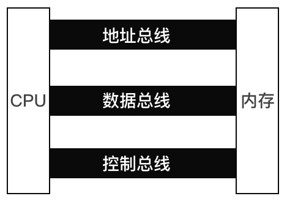
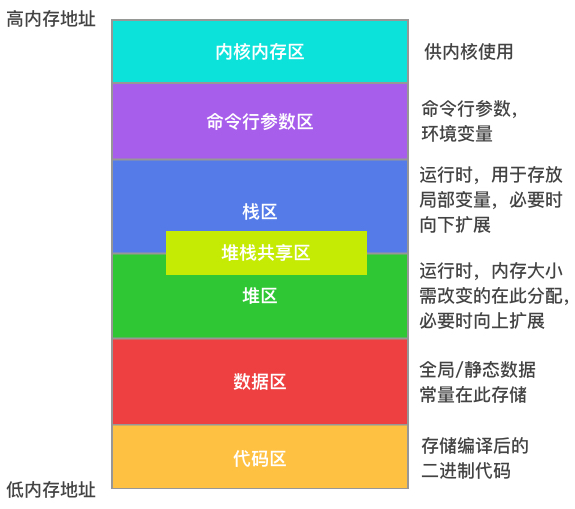

# 内存分配

为了保证计算机的运行速度，CPU不允许直接访问硬盘，只能直接访问内存，而CPU和内存之间靠地址总线、数据总线和控制总线进行通信。

### 地址总线

cpu是通过地址总线来指定存储单元的，一个cpu有n根地址总线，则这样的cpu可以寻找2的n次方个内存单元(byte)。

| 地址总线数量 | 内存单元数量       |
| ------------ | ------------------ |
| 1            | 1B = 1byte = 8bits |
| 32           | 4GB                |
| 64           | 16GB               |
目前个人电脑配置的cpu一般有64根地址总线，最多可支持16GB的内存扩展。

### 数据总线

cpu与内存或其他器件之间的数据传送是通过数据总线来进行的，数据总线的宽度决定了cpu和外界的数据传送速度。

### 控制总线

cpu对外部器件的控制是通过控制总线来进行的，控制总线的宽度决定了cpu对外部器件的控制能力。

### 地址

地址总线以byte为单位，把可支持的内存容量进行均分，每一个内存单元分配一个从0开始的整数自增编号，这些编号被称为地址。

### 指针

在支持指针的编程语言中，指针就是存储地址的变量，通常是用16进制表示的整数，这个整数确定数据在内存中存储的起始位置，终点位置由指针的类型确定。

例如：byte类型的变量在编程语言中占一个字节，其地址为`0xc000014070`，则表示编号为`0xc000014070`的内存单元存储着该byte类型数据，由于byte只占一个字节，所以其结束的位置也是`0xc000014070`。

### 运行时分配

一个程序在运行时，其内存分配基本如上图所示，临时变量和局部变量都在堆栈上分配内存，而且堆栈之间并没有明确的分界线，会彼此扩展，当两边扩展到内存地址相撞时，就出现了内存溢出。

一般情况下，能够确定内存大小的变量都会被分配在栈中，借用栈先进后出的特性，当一段程序运行完成后，这些在栈中的局部变量也会因为出栈被销毁。

而对于那些在声明时不能确定其内存大小的变量，会在堆中进行分配，最常见的就是动态数组和字典。
