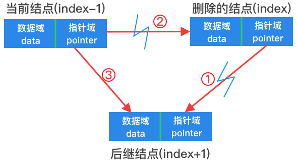

# 单链表


如上图所示，单链表的结构十分简单，每个结点仅包含一个数据域和指针域。

### 头结点

**头结点**是一个数据域为空的结点，作为链表的第一个结点。对于链表来说，头结点并不是必须的。

### 首结点

**首结点**是链表中的第一个有效结点，即第一个数据域存在数据的结点，头结点的指针域指向该结点。

### 尾结点

**尾结点**是链表中的最后一个有效结点，即第一个数据域存在数据的结点，当使用尾插法构建链表时才会用到。

### 头指针

**头指针**永远指向链表的第一个结点，如果存在头结点，则指向头结点，否则指向首结点。

### 尾指针

**尾指针**永远指向链表的最后一个结点，即指向尾结点，和尾结点配合使用。

### 结构定义

以下给出了一个以`int`为数据类型的单链表结构定义：

```go
type (
	// 单链表结点
	singleNode struct {
		data int         // 结点元素值(数据域)
		next *singleNode // 后继结点(指针域)
	}

	// 单链表
	singleList struct {
    size int         // 单链表中结点元素个数
		head *singleNode // 单链表中的头指针
    tail *singleNode // 单链表中的尾指针
	}
)
```

### 实现思路分析

• 从头部插入


1. 创建新结点
2. 新结点的指针域指向首结点
3. 断开头结点和首结点的指向关系
4. 头结点的指针域指向新结点

• 从尾部插入


1. 创建新结点
2. 旧的尾结点指针域指向新结点
3. 断开尾指针和尾结点的指向关系
4. 尾指针指向新结点，新结点成为新的尾结点

• 查找结点


1. 声明一个临时结点指针变量和自增索引
2. 从首结点开始查找
3. i自增，temp指向后继结点
4. i等于index时，返回该结点

• 从任意位置插入

先查找到指定位置的结点


1. 创建新结点
2. 新结点的指针域指向后继结点
3. 断开当前结点和后继结点的指向关系
4. 当前结点指针域指向新结点

• 删除指定位置结点

先查找指定位置的前一个结点(index-1)



1. 断开删除的结点和其后继结点的指针关系
2. 断开当前结点和删除的结点的指针关系
3. 将当前结点的指针域指向后继结点

• 给指定位置结点赋值

先查找到指定位置的结点

将指定的值赋给当前结点

• 查找指定位置结点的值

先查找到指定位置的结点

将该结点的值返回

• 有效结点的个数

如果链表结构中有size成员，则直接返回该值

如果没有size，从头结点开始遍历，并用计数器记录有效结点个数，遍历的技术条件为结点的`next`指针域为空。

• 判断链表是否为空

如果链表结构中有size成员，size为0，则为空，否则不为空

如果没有size，判断其头结点的指针域是否为空

• 遍历

先计算出链表的长度，声明一个改长度的数组存储遍历后的链表中的元素
