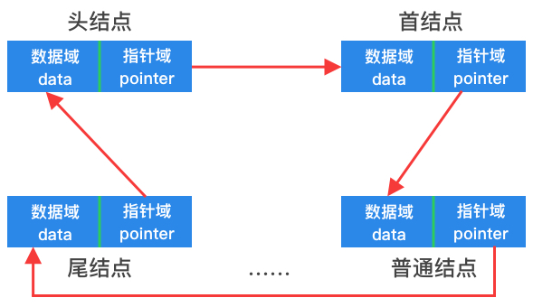

# 单向循环链表



如上图所示，单向循环链表只不过是在单链表的基础上，将尾结点的指针域指向了头结点，这样形成了一个环状。

### 结构定义

以下给出了一个以`int`为数据类型的单向循环链表结构定义：

```go
type (
	// 单向循环链表结点
	singleCycleNode struct {
		data int              // 结点元素值
		next *singleCycleNode // 后继结点
	}

	// 单向循环链表
	singleCycleList struct {
		size int              // 单向循环链表中结点元素个数
		head *singleCycleNode // 单向循环链表中的头指针
		tail *singleCycleNode // 单向循环链表中的尾指针
	}
)
```

### 方法与实现思路

单向循环链表的所有方法与单链表基本一致，只不过在涉及到尾结点的操作时，将尾结点的指针域指向头结点。
