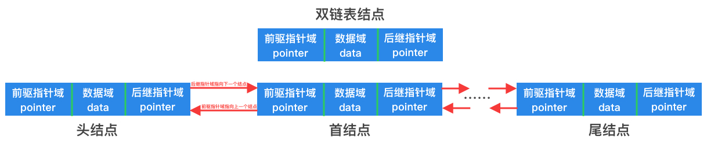
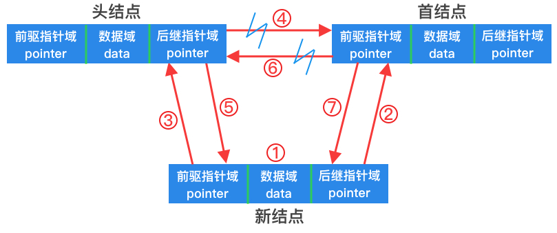
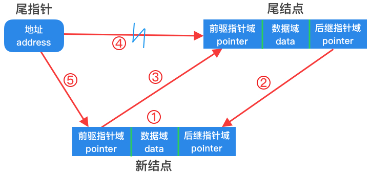

# 双链表



如上图所示，双链表在单链表的基础上增加了一个指针域。每个结点包含一个数据域(存储数据)，前驱指针域(指向上一个结点)，后继指针域(指向下一个结点)。

### 结构定义

以下给出了一个以`int`为数据类型的双链表结构定义：

```go
type (
	// 双向链表结点
	doubleNode struct {
		data  int         // 结点元素值(数据域)
		prior *doubleNode // 前驱结点(指针域)
		next  *doubleNode // 后继结点(指针域)
	}

	// 双向链表
	doubleList struct {
		size int         // 双链表中结点元素个数
		head *doubleNode // 双链表中的头指针
    tail *doubleNode // 双链表中的尾指针
	}
)
```

### 方法与实现思路

• 头插入



0. 通过头指针找到头结点和首结点
1. 创建新结点
2. 新结点的后继指针域指向首结点
3. 新结点的前驱指针域指向头结点
4. 断开头结点的后继指针域
5. 头结点的后继指针域指向新结点
6. 断开首结点的前驱指针域
7. 首结点的前驱指针域指向新结点

• 尾插入



1. 创建新结点
2. 尾结点的后继指针域指向新结点
3. 新结点的前驱指针域指向尾结点
4. 断开尾指针和尾结点的指向关系
5. 尾指针指向新结点

• 删除


0. 查找到指定位置的结点
1. 断开待删除结点和其前驱结点的指向关系
2. 断开待删除结点和其后继结点的指向关系
3. 将后继结点的前驱指针域指向前驱结点
4. 将前驱结点的后继指针域指向后继结点

双链表结点可以直接将自己从链表中删除
