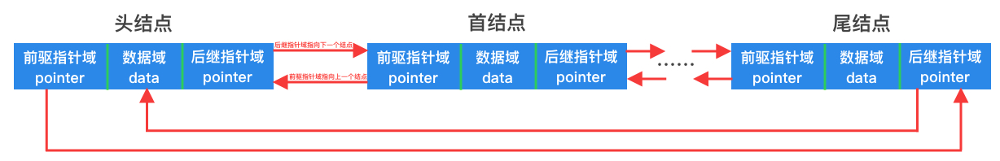

# 双向循环链表



如上图所示，双向循环链表只不过是在单链表的基础上，将尾结点的后继指针域指向了头结点，同时将头结点的前驱指针域指向了尾结点，这样形成了一个环状，因此能够通过头结点直接确定尾结点，所以其结构定义中不需要尾指针。

### 结构定义

以下给出了一个以`int`为数据类型的双向循环链表结构定义：

```go
type (
	// 双向循环链表结点
	doubleCycleNode struct {
		data  int              // 结点元素值(数据域)
		prior *doubleCycleNode // 前驱结点(指针域)
		next  *doubleCycleNode // 后继结点(指针域)
	}

	// 双向循环链表
	doubleCycleList struct {
		size int              // 结点元素个数
		head *doubleCycleNode // 头指针
	}
)
```

### 方法与实现思路

双向循环链表的所有方法与双链表基本一致，只不过在尾插入时不需要再借助尾指针。
