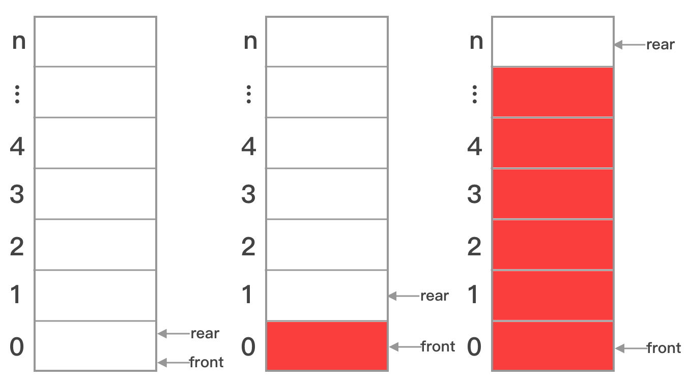
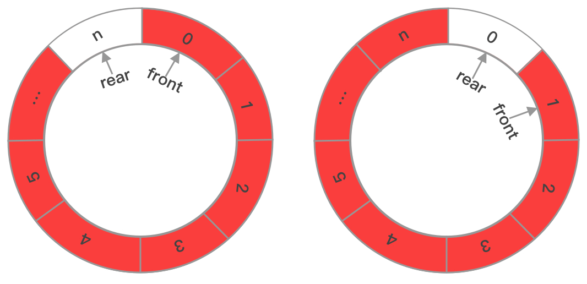
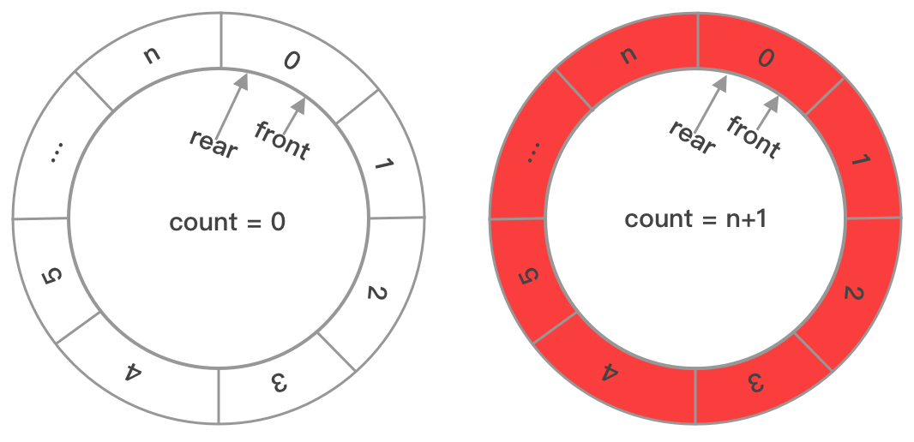

# 数组实现队列

数组是一种顺序存储的线性存储结构，系统会在内存中开辟一块连续的存储空间，所以数组的长度一旦确定，就不能改变。因此用数组实现队列时，如果不循环利用数组的每个元素的话，那么该队列的实际使用意义并不大，故通常用数组实现循环队列。

与现实中的排队相似，春运的火车站，安检区域可排队长度是有限的，数组声明的长度就与之类似，只有前面的人安检完后，后面的人才能补上，数据结构中的队列就是这个原理。

在排队过程中，安检区域是否排满，会有工作人员进行判断，而在队列的实现工程中，判断队列是否已满正是数组实现循环队列的难点。

### 简单队列



如上图所示，front指向队首，rear指向队尾，当队列为空时，front=rear=0；当队列有1个元素时，front=0，rear=1；当队列有n-1个元素时，front=0，rear=n。

当要向该队列添加第n个元素时，rear就会变为n+1，此时会出现数组下标越界。若添加第n个元素时，rear重新指向0，此时会和空队列的情况冲突，所以这种模式下，长度为n+1的数组实现的队列只能容纳n个元素。

当元素出队时，只需将front后移，当front=rear=n时，队列已经被完全使用，无法再添加元素，这种一次性的队列相当不环保，所以为了循环利用分配的内存空间，有必要实现循环队列。

### 循环队列



如上图所示，循环队列，可以视为一个环形，通过简单队列满队列的讨论可知，对于循环队列，当队列满时，存在两种情况：

1.front=0，rear=n，与简单队列的满队列一致；
2.front=x，rear=x-1，0 < x < n + 1，即front=rear+1

以上两个条件可以通过取模运算进行统一表示：

如果用size表示数组的长度，由于满队列时，front在环形的头部，rear在环形的尾部，那么front和rear+1模sise是同余的，即front%size == (rear+1)%size，因为front<size，所以front%size=front，化简后可得，front==(rear+1)%size。

队列为空的条件是显而易见的，即front=rear

在这种情况下，长度为n+1的数组实现的循环队列只能容纳n个元素。



在某些情况下，数组中存储的元素的内存较大(当然可以用指针避免)，在第一种循环队列中，要空出一个元素来判断队列是否已满，会导致浪费内存，于是出现了上图中的实现方式。

定义一个成员变量`count`，当count=size时，队列已满，当count=0时，队列为空，在这种模式下，长度为n+1的数组实现的循环队列能够容纳n+1个元素。

### 结构定义

以下给出了一个以`int`为数据类型的循环队列结构定义：

```go
type arrayQueue struct {
	size  int   // 队列的大小
	count int   // 队列中的元素个数
	arr   []int // 存储队列中元素的切片
	front int   // 头游标，0-(size-1)
	rear  int   // 尾游标，0-(size-1)
}
```

### 方法实现与思路

* 入队

在入队前要判断队列是否已满，若满队则不能入队，入队成功rear自增，rear = (rear + 1) % size。

* 出队

在出队前要判断队列是否为空，若空对则不能出队，出队成功front自增，front = (front + 1) % size。
