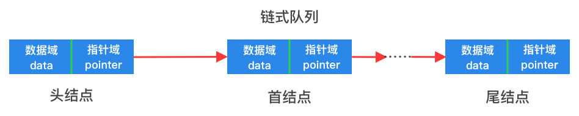

# 链表实现队列

在上一章中已经实现了几种常见的链表结构，它是一种线性但非顺序存储的数据结构。因此利用链表实现队列时，不存在满队的情况，不需要在创建队列时就申请内存空间，每个结点元素可即用即建。

### 链式队列



如上图所示，链式队列就是在单链表的结构上删除一些方法，再定制一些特殊方法后形成的一种数据结构。

### 结构定义

以下给出了一个以`int`为数据类型的链式队列结构定义：

```go
type (
	// 链表结点
	linkedListNode struct {
		data int             // 结点元素值
		next *linkedListNode // 后继结点
	}

	// 使用链表的方式实现队列
	//
	// 添加一个size属性
	// size主要用途是在遍历的时候申请长度为size的切片
	// 避免使用append函数，导致频繁分配内存
	linkedListQueue struct {
		size int             // 队列的当前大小
		head *linkedListNode // 链表头结点(非首结点)
		tail *linkedListNode // 链表尾结点
	}
)
```

### 方法实现与思路

* 入队

入队即是在链表的尾部添加元素，与单链表的Append方法实现一致。

* 出队

出队即是删除链表中的首结点，与单链表的Delete发放实现一致，只选将index参数设置为0即可。
