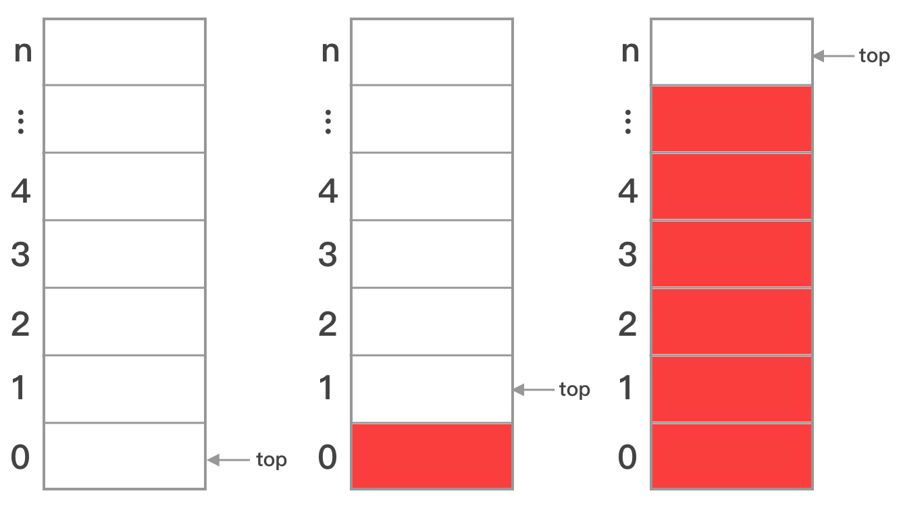

# 数组实现栈

栈的实现思路十分简单，需要一个栈底指针和一个栈顶指针，压栈时从栈顶添加，出栈时从栈顶弹出，当栈顶和栈底重合时，栈空。由于数组在内存中的存储地址是连续的，所以用它实现栈时，不需要栈底指针，因为索引0就是固定的栈底。

### 基本结构



如上图所示，在大多数编程语言中，如果top定义为整数型，则其默认值为0，出现了长度为n的数组实现的栈只能容纳n-1个元素的现象，一般解决方法可将top定义为指针类型，另外还可以为栈添加一个大小的成员变量。

### 结构定义

以下给出了一个以`int`为数据类型的栈结构定义：

```go
type arrayStack struct {
	size int   // 栈的大小
	arr []int  // 存储栈中元素的切片
	top int    // 栈顶下标
}
```
