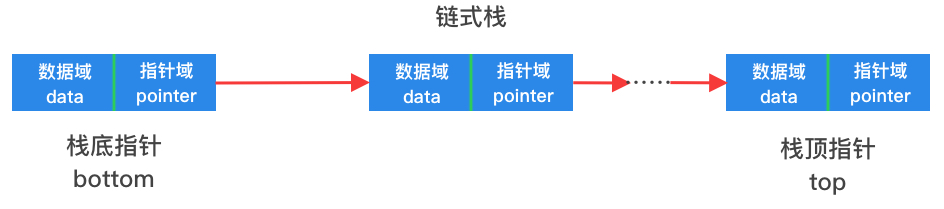

# 链表实现栈

用链表实现的栈通常被叫做链式栈，链式栈本质是将链表的一些功能进行删减后所实现的栈这种数据结构，将链表中的头尾指针转变为栈顶和栈底指针即可。

### 基本结构



如上图所示，栈顶指针就是单链表中的尾指针，压栈就是在末尾添加结点元素，同样，出栈就是在末尾删除结点元素。

### 结构定义

以下给出了一个以`int`为数据类型的链式栈结构定义：

```go
type(
	// 链表结点
	linkedListNode struct {
		data int             // 结点元素值
		next *linkedListNode // 后继结点
	}

	// 使用链表的方式实现栈
	//
	// 添加一个size属性
	// size主要用途是在遍历的时候申请长度为size的切片
	// 避免使用append函数，导致频繁分配内存
	linkedListStack struct {
		size   int             // 队列的当前大小
		top    *linkedListNode // 栈顶结点
		bottom *linkedListNode // 栈底结点
	}
)
```
