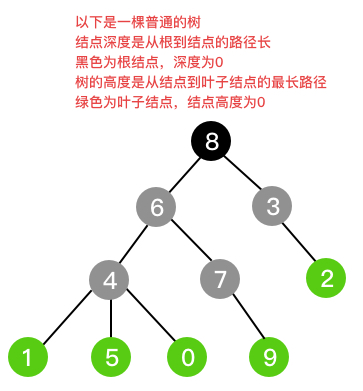

# 树
树是一种非线性结构，是一种以层级关系进行存储的数据结构。

上图展示了一棵普通的二叉树，每一个元素叫做结点，它由10个结点构成，其中`黑8`结点是根结点，`绿2、1、5、0、9`是叶子结点。对于任意一个结点，与其相连的上一层结点为其双亲结点(父结点)，与其相连的下一层结点为其孩子结点，同一个结点的所有孩子结点互为兄弟结点，例如`灰3`结点的双亲结点是`黑8`，孩子结点是`绿2`，兄弟结点是`灰6`。

当组成树的结点个数为0时，称为空树。非空树有且仅有一个根结点。当去掉根结点后，会得到一棵或多棵新树，这些树叫做根的子树。可见，每个有孩子结点的结点都有子树，所以树是一种递归的定义方式。多棵树构成一片森林。

结点的深度是从根结点到该结点的路径长。
树的高度是所有叶子结点的深度中的最大值。
