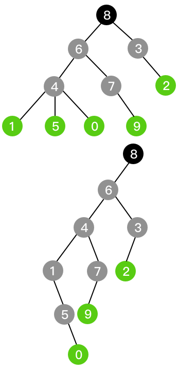
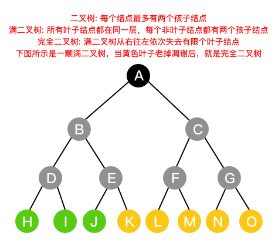
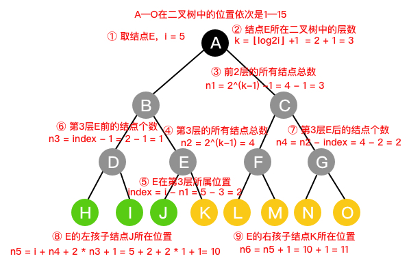

# 二叉树

对于组成树的所有结点，每个结点至多有两个孩子结点，这样的树叫做二叉树。

通过孩子兄弟表示法，可以把原来的树变成了上图所示的只有左子树的二叉树，按照此表示法，还可以将森林转换成二叉树。

### 二叉树性质

总结点数为n，叶子结点数为
$$n_0$$
，度为1的结点(只有一个孩子的结点)数为
$$n_1$$
，度为2的结点(有两个孩子的结点)数为
$$n_2$$
。

* 满二叉树是一种特殊的完全二叉树

* 二叉树第i层最多有
  $$2^i$$
  个结点

* 深度为k的二叉树最多有
  $$2^k - 1$$
  个结点

* $$n_0=n_2+1$$

* n个结点的完全二叉树的深度k为
  $$k=\lfloor log_2n \rfloor + 1$$

* 一棵有n个结点完全二叉树第i个结点：

| i | left child | right child | comment |
| :---: | :---: | :---: | :---: |
| 1 | 2 | 3 | 根结点 |
| 2i > n | 无 | 无 | 叶子结点 |
| 2i + 1 > n | 2i | 无 | 无右孩子 |
| 2i + 1 < n | 2i | 2i + 1 | 有两孩子 |

### 性质证明

1. 根据完全二叉树的定义可知，在满二叉树是失去0个叶子结点的二叉树。

2. 根据二叉树的定义，每个结点最多有两个孩子结点，所以每层的结点数的最大值就构成一个首项为1，公比为2的等比数列，所以
   $$a_n=a_0*2^n$$

3. 由上一条可知，深度为k的结点总数的最大值即为等比数列前k项和，所以
  $$s_k=\frac{1-2^k}{1-2}=\frac{2^k-1}{2-1}=2^k-1$$

4. 根据结点数可得等式：
   $$n = n_0 + n_1 + n_2$$
   根据树杈(连线)数可得等式：
   $$n - 1 = n_1 + 2*n_2$$
   上式左边可以看做是除了根结点外，每个结点都有一个指向其双亲结点的树杈(连线)，上式右边看做是除了叶子结点外，每个结点指向其孩子结点的树杈(连线)。
   两式相减可得等式：
   $$1 = n_0 - n_2$$
   即
   $$n_0=n_2+1$$

5. 由第3条可知，
   $$s_k=2^k-1$$
   ，已知
   $$s_k \geqslant n$$
   即
   $$2^k-1 \geqslant n$$
   ，移项后两边同时取对数得：
   $$k \geqslant log_2(n+1)$$
   由于k是整数，所以对其进行向上取整，
   $$k = \lceil log_2(n+1) \rceil$$
   显然，
   $$\lceil log_2(n+1) \rceil = \lfloor log_2n \rfloor + 1$$
   ，所以
   $$k=\lfloor log_2n \rfloor + 1$$

6. 由第5条可知，第i个结点在第
   $$\lfloor log_2n \rfloor + 1$$
   层，令
   $$k=\lfloor log_2n \rfloor + 1$$
   ，前k-1层总结点数
   $$n_1=2^{k-1}-1$$
   ，如果i不是叶子结点，则第k层的总结点数
   $$n_2=2^{k-1}$$
   ，i在第k层所属位置
   $$index=i - n_1$$
   ，在第k层i前的结点个数
   $$n_3=index - 1$$
   ，在第k层i后的结点个数
   $$n_4=n_2 - index$$
   ，第i个结点的左孩子结点位置
   $$n_5 = i + n_4 + 2 * n_3 + 1
         = i + (n_2 - index) + 2 * (index - 1) + 1
         = i + n_2 - index + 2 * index - 2 + 1
         = i + index + n_2 - 1
         = i + i - n_1 + n_2 - 1
         = 2 * i - 2^{k-1} + 1 + 2^{k-1} - 1
         = 2 * i
   $$
   ，第i个结点的右孩子结点位置
   $$n_6 = n_5 + 1 = 2 * i + 1$$

第6条的证明可以参考下图中的实例。

