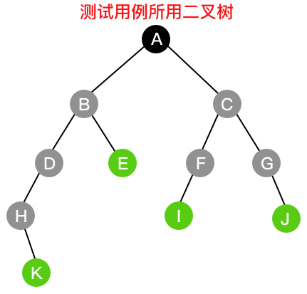

# 二叉树的遍历

由于二叉树有一定的规律性，所以可以用数组进行存储，也可以用链表进行存储。存储树的数据后，后期需要读取数据，就需要对二叉树进行遍历。

二叉树的遍历方式分为前序遍历、中序遍历、后续遍历和层序遍历，以下图二叉树为例

### 前序(先序)遍历

根——左子树——右子树

ABDHIEJKCFLMGNO

### 中序遍历

左子树——根——右子树

HDIBJEKALFMCNGO

### 后序遍历

左子树——右子树——根

HIDJKEBLMFNOGCA

### 层序遍历

分层遍历

ABCDEFGHIJKLMNO

**结论**：(前序遍历 + 中序遍历) 和 (中序遍历 + 后序遍历) 均可以确定唯一的二叉树。

**证明**：前序遍历和后序遍历可以迅速确定整棵树的根，而中序遍历可以根据根划分左子树和右子树，子树在前序遍历和后序遍历的序列中又可以确定子树的根，因此能够唯一确定一颗二叉树。

而前序遍历和后序遍历均无法区分左子树和右子树，因此这两种遍历的组合不能唯一确定一颗二叉树。

### 递归遍历

递归遍历就如同数学归纳法一样，按照特定的遍历步骤，只需要规定退出条件即可。

### 非递归遍历

1. 非递归顺序遍历思路分析(需要借助栈实现)：

* 找到二叉树的根结点
  > 前序遍历：根结点为第一个输出结点，输出，压栈
  >
  > 中序遍历：根结点不是第一个输出结点，压栈
  >
  > 后序遍历：根结点为最后输出结点，压栈

* 遍历根结点的左子树
  > * 左子树为空
  >> 前序遍历：出栈，获取双亲结点，遍历右子树
  >>
  >> 中序遍历：出栈，获取双亲结点，输出，遍历右子树
  >>
  >> 后序遍历：出栈，获取双亲结点，设置该结点已经访问过的标记，遍历右子树
  >
  > * 左子树不为空
  >> 前序遍历：将当前结点(左子树根结点)作为一棵新的二叉树的根结点，进行前序遍历
  >>
  >> 中序遍历：将当前结点(左子树根结点)作为一棵新的二叉树的根结点，进行中序遍历
  >>
  >> 后序遍历：将当前结点(左子树根结点)作为一棵新的二叉树的根结点，进行后序遍历

* 遍历根结点的右子树
  > * 右子树为空
  >> 前序遍历：出栈，获取双亲结点，遍历右子树
  >>
  >> 中序遍历：出栈，获取双亲结点，遍历右子树
  >>
  >> 后序遍历：出栈，获取双亲结点，输出，设置该结点已经访问过的标记，遍历右子树
  >
  > * 右子树不为空
  >> 前序遍历：将当前结点(右子树根结点)作为一棵新的二叉树的根结点，进行前序遍历
  >>
  >> 中序遍历：将当前结点(右子树根结点)作为一棵新的二叉树的根结点，进行中序遍历
  >>
  >> 后序遍历：根据被访问过的标记进行判断，如果当前结点(右子树根结点)被访问过，则输出当前结点的双亲结点，如果当前结点未被访问过，则将其作为一棵新的二叉树的根结点，进行后序遍历

* 遍历结束条件
  > 当通过出栈获取双亲结点时，发现栈为空，表示此时的二叉树已经遍历完成

2. 层序遍历

  对于顺序存储(数组存储)的二叉树，其层序遍历只需要将空的结点排除掉就可以得到层序遍历的结果。

  链式存储的二叉树需要借助队列实现，基本思路如下图所示：
  
  重复第3—9步，直到队列为空，即可得到层序遍历结果。
  k层(k从0开始)的二叉树第k-1层最多有
  $$2^{k-1}$$
  个结点，如果设置条件只有非叶子结点才入队，那么队列的最大长度为
  $$2^{k-1}$$
  。
