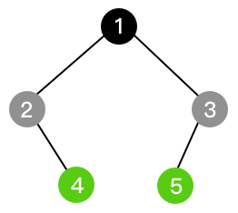
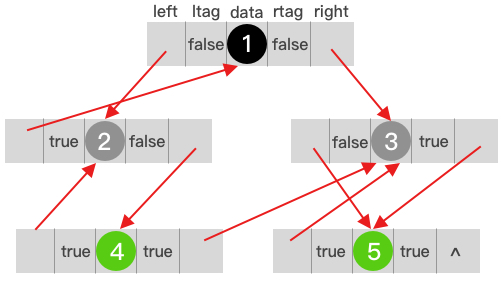

# 线索化二叉树

在实际应用中，并不是所有的二叉树都是完全二叉树，存在着许多左孩子或者右孩子结点为空的情况，这样就会造成部分存储空间的浪费，为了提高二叉树的遍历效率，可以合理利用这些存储空间，对二叉树进行线索化。

二叉树的线索化是将非叶子结点的为空的左孩子结点指向其前驱结点，为空的右孩子指向后继结点，由于不同的遍历顺序会导致结点的前驱结点不同，所以线索化是针对某种特定的顺序遍历而言的。

### 线索化过程

上图展示了一棵非常简单的二叉树，结点2没有左孩子结点，所以将左孩子指针指向其前驱结点，结点3没有右孩子结点，所以将右孩子指针指向其后继结点。

为了能够区分指针域指向的是孩子结点还是线索化的结点，需要添加一个标识进行区分，false表示是孩子结点，true表示是线索化的结点。

对图中的二叉树以前序遍历为例：

前序遍历的结果为：12435

从上图可以看出，线索化后的结构本质上是一个双向链表，所以能够很快的进行顺序遍历。

如果在该双向链表的基础上添加一个头结点，左指针指向首结点`1`，右指针指向尾结点`5`，同时将结点`5`的右孩子指针指向头结点，这样就构成了一个双向循环链表。

### 应用场景

一旦将二叉树线索化后，就可以将二叉树当做双向链表(或者双向循环链表)进行操作，将查找前驱或后继结点的操作简化为一步，所以二叉树的线索化适合于需要频繁查找某种遍历顺序的前驱或后继结点的场景。
