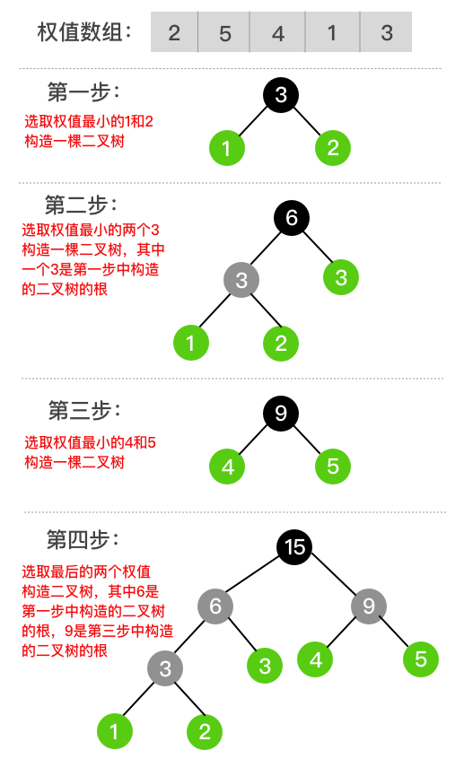
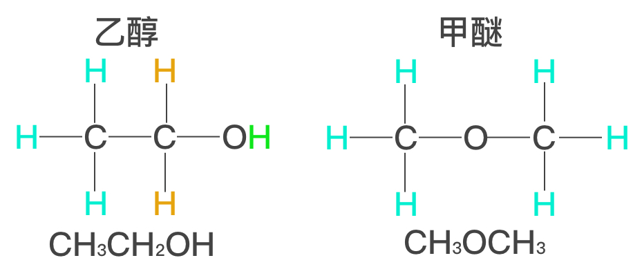
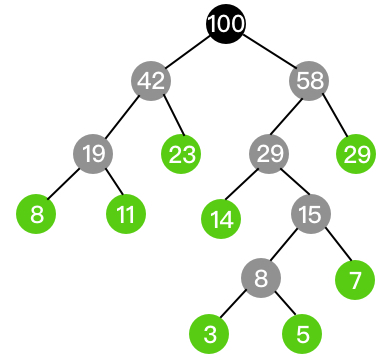
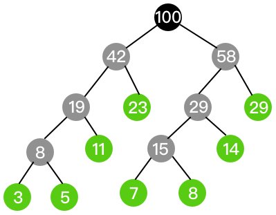

# 哈夫曼树

若将树中结点赋给一个有某种含义的数值，则这个数值称为该**结点的权**。

从根结点到该结点之间的路径长度与该结点的权的乘积称为**结点的带权路径长度**。

树的所有叶子结点的带权路径长度之和为**树的带权路径长度(WPL weighted path length)**。

给定n个权值作为n个叶子结点，构造一棵二叉树，若该树的**带权路径长度**达到最小，这样的二叉树为最优二叉树，即哈夫曼树(Huffman Tree)。

### 哈夫曼树的构造

1. 取出最小的两个权值构造二叉树，根结点的权值为孩子结点的权值和；
2. 在新的权值和剩余的权值中再取出最小的两个构造二叉树；
3. 重复上述步骤，将所有权值处理完，就得到了哈夫曼树。



以[1, 2, 3, 4, 5]为权值数组，构造哈夫曼树的过程如上图所示，所有绿色的叶子结点对应权值数组中的值。

### 同权不同构

在有机化学中，存在许多分子式相同但结构不同的有机物，我们称之为同分异构体，如甲醚和乙醇。



最优二叉树也是如此，即哈夫曼树的构造并不是唯一的。此种情况大多出现在构造出的二叉树的根和权值数组中的某个权值相等条件下。

例如，权值数组[3, 5, 7, 8, 11, 14, 23, 29]，显然地，3+5=8，7+8+14=29，所以由该权值数组可以构造出多种不同结构的哈夫曼树。



上图是其中的一个哈夫曼树。

```
WPL = (23 + 29) * 2
    + (8 + 11 + 14) * 3
    + 7 * 4
    + (3 + 5) * 5
    = 104 + 99 + 28 + 40
    = 271
```



上图是其中的另一个哈夫曼树。

```
WPL = (3 + 5 + 7 + 8) * 4
    + (11 + 14) * 3
    + (23 + 29) * 2
    = 92 + 75 + 104
    = 271
```
