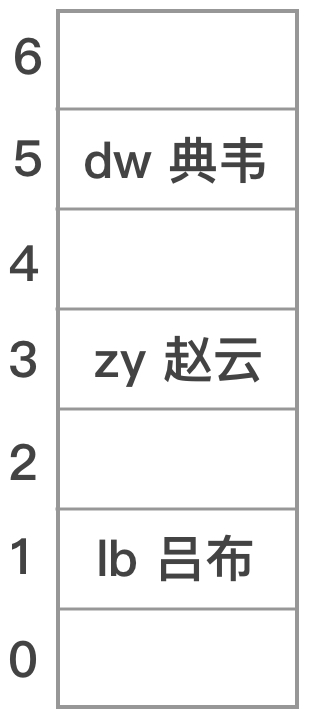
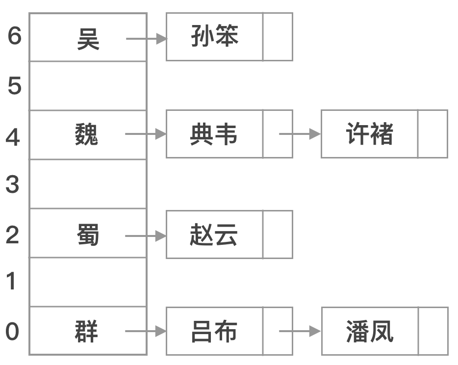

# 散列函数

如上图所示，将武将的名字作为**数据域**，名字拼音首字母作为**关键字**，根据特定的映射规则，按照关键字将武将放入适当的存储单元中，这个映射就叫做**散列函数**。

### 基本原则

1. 散列函数的定义域必须包含需要存储的关键字的所有可能性。
2. 散列函数计算出来的结果应该是等概率，均匀分布的，从而减少冲突。
3. 散列函数应该尽量简单，能够在较短的时间内计算出结果。

### 常用函数

1. 直接定址法

直接取关键字的某个线性函数值为散列地址，散列函数为H(key) = a x key + b，a和b是常数。

优点：简单，均匀，不会产生冲突。

缺陷：适合关键字分布连续的情况，若关键字不连续，空位较多，将造成存储空间的浪费。

2. 除留余数法

对于表长为m的散列表，取一个不大于m但最接近或等于m的质数p，通过模运算把关键字转换成散列地址，散列函数为H(key) = key % p。

优点：简单有效，冲突概率较低。

缺陷：确定质数p值得过程稍显麻烦。

3. 数字分析法

当关键字是位数较多的数字时，由于某些位上数字不是均匀分布的，所以抽取数字均匀分布的若干位作为散列地址。例如手机号首位均为1，前三位对应不同的运营商，中间四位是归属地的识别码，也就是说前七位不是均匀分布的，所以抽取后四位作为散列地址。

优点：适合处理关键字位数比较大的情况。

缺点：要求关键字若干位分布均匀，且已知关键字集合，如果更换了关键字，需要重新构造新的散列函数。

4. 平方取中法

取关键字的平方值的中间几位作为散列地址，具体取多少位依据实际情况(散列表表长)而定。

优点：适合不知道关键字分布是否均匀的情况。

缺陷：关键字位数较大时，计算平方值容易数值越界。

5. 折叠法

将关键字分割成位数相同的几部分(最后一部分的位数可以短一些)，然后取这几部分的叠加和作为散列地址。

优点：适合关键字位数较多的情况，实现不需要知道关键字的分布。

缺点：需要按照表长对关键字进行分割。

> 如果关键字是数值类型，可以直接将以上常用函数作为散列函数，若关键字是字符串，一种常用的方法是把字符串中字符的ASCII码(或Unicode码)值加起来，再使用常用函数作为散列函数。

#### 解决冲突

散列表的表长一旦确定，由于存储单元的数目是有限的，而关键字实际上是用不完的，因此存在两个关键字散列到同一存储单元的情况，这叫做冲突。

1. 开放定址法

开放定址法是指一旦发生冲突，就寻找下一个空闲地址，并将记录存入。其数学递推公式为：

$$H_i(key)=(H(key)+d_i)%m$$

$$0 < i \leqslant m - 1$$

$$d_i$$
为增量序列，m为表长。

增量序列通常有以下四种取法：

* 线性探测法

$$d_i=0, 1, 2, …, m-1$$

* 平方探测法(二次探测法)

$$d_i = 0, 1^2, -1^2, …, k^2, -k^2. k \leqslant \frac{m}{2}$$

当m=4k+3(素数)，则整个表均可被探测到。

* 再散列法(双散列法)

利用新的散列函数计算增量序列，增量的公式为：

$$d_i = i * Hash(key)$$

* 伪随机序列法

对于一个散列表用相同的随机种子，得到一个随机数列，将该数列作为增量序列。

2. 链地址法(拉链法)

如上图所示，将所有冲突的数据存储在一个线性链表中，这个线性链表由散列地址唯一标识。

3. 公共溢出区法

为所有冲突的关键字建立一个公共的溢出区，溢出区不再进行散列，而是按顺序存储。

4. 再散列函数法

对于散列表，事先准备多个散列函数，每当发生散列地址冲突时，就换一个散列函数计算，直到解决冲突为止，当然这也相应的增加了计算时间。
