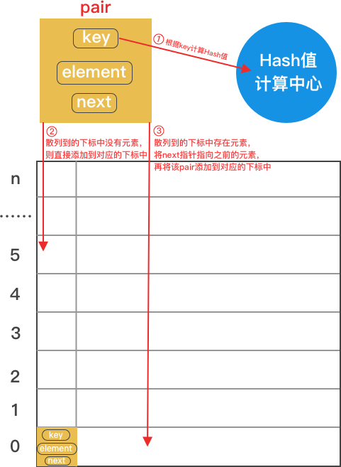
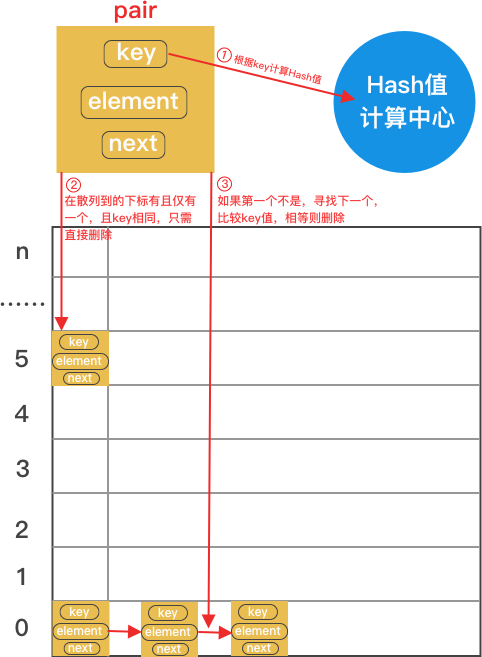
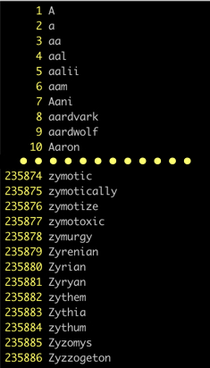

# 散列表

散列表是以常数时间复杂度进行查找、添加和删除实现的，根据这三个基本功能，可以先定义一个方法接口。

```go
type Key interface{}

type Value interface{}

type Stringer interface {
	String() string
}

// 散列表接口
type Table interface {
	// Pet 向散列表中添加元素
	Pet(key Key, value Value) error
	// Delete 从散列表中删除元素
	Delete(key Key) error
	// Get 从散列表中获取指定元素
	Get(key Key) (Value, error)
	// Len 获取散列表的表长
	Len() int
}
```

### 用map实现散列表

`map`是`goalng`中的一种内建的类型，通常被称作为字典，将数据以键值对的形式进行存储，但是map自身不是并发安全的，所以在实现散列表时添加读写锁。

* 结构定义

```go
// 散列表
type hashTable struct {
	// 键值对，key为hash值
	items map[int]Value
	// 读写锁
	lock  sync.RWMutex
}
```

* hash值的计算

根据Horner法则，计算一个合适的素数的多项式，参考jdk中的实现，素数选择31。

```go
// HashCode 计算key的hash值
// 选取素数31计算多项式的和
func HashCode(k Key) int {
    var key string
	if str, ok := k.(Stringer); ok {
		key = str.String()
	} else {
		// 将k格式化为字符串
		key = fmt.Sprintf("%s", k)
	}
	// 按字符分割
	keyRune := []rune(key)
	hc := 0
	for _, ch := range keyRune {
		// 通常根据Horner法则，计算一个多项式
		// 形式为：int(keyRune[0])*k^(n-1) + int(keyRune[1])*k^(n-2) + ... + int(keyRune[n-1])
		// 其中k是一个常数，一般选择一个大小适中的素数，根据除留余数法可知，素数会减少冲突
		// 其中n是字符数组的长度
		hc = 31*hc + int(ch)
	}
	return hc
}
```

* Put实现

Put实现向散列表中添加键值对的功能，计算关键字的hash值，并将其作为key存入map中。

```go
// Put 向散列表中添加键值对
func (ht *hashTable) Put(k Key, v Value) error {
	if k == nil { // key不能为nil
		return errors.New("key can not be nil")
	}
	if v == nil { // value不能为nil
		return errors.New("value can not be nil")
	}

	ht.lock.Lock()
	defer ht.lock.Unlock()
	code := HashCode(k)
	if ht.items == nil {
		ht.items = make(map[int]Value)
	}
	ht.items[code] = v
	return nil
}
```

* Get实现

Get实现向散列表中根据关键字获取值得功能，计算关键字的hash值，并将其作为key从map中获取值。

```go
// Get 根据关键字从散列表获取值
func (ht *hashTable) Get(k Key) (Value, error) {
	if k == nil { // key不能为nil
		return nil, errors.New("key can not be nil")
	}

	ht.lock.RLock()
	defer ht.lock.RUnlock()
	if len(ht.items) == 0 {
		return nil, errors.New("table is empty")
	}
	code := HashCode(k)
	return ht.items[code], nil
}
```

* Delete实现

```go
// Delete 根据关键字从散列表中删除元素
func (ht *hashTable) Delete(k Key) error {
	if k == nil { // key不能为nil
		return errors.New("key can not be nil")
	}

	ht.lock.Lock()
	defer ht.lock.Unlock()
	if len(ht.items) == 0 {
		return errors.New("table is empty")
	}
	code := HashCode(k)
	delete(ht.items, code)
	return nil
}
```

### 解决冲突散列表

在基础版本的散列表中实现了最基本的功能，但是没有解决hash值冲突的问题，所以采用常用的链地址法解决冲突。

* 结构定义

为了让散列表支持所有类型的数据，同时

```go
// 高级版散列表
type seniorTable struct {
	lock   sync.RWMutex // 读写锁
	values []*pair      // 每个链表
	total  uint64       // 记录元素个数
	prime  int          // 除留余数法的素数p
}

// 键值对链表结构
type pair struct {
	key     Key            // 关键字
	element unsafe.Pointer // Value值的内存地址
	next    unsafe.Pointer // 下一个pair的内存地址
}
```

* 添加键值对

根据关键字计算散列地址(数组下标)，如果下标对应为空，则直接添加到对应下标的位置；如果不为空，利用表头插入法，将新元素的next指向原来的值，再将新元素添加到对应下标位置。

之所以用表头插入法，是因为在一般的实践应用中，最近被插入的元素最容易被取出。



* 获取键值对

根据关键字计算散列地址(数组下标)，如果下标对应为空，则表示不存在；比较key值，进行查找，如果第一个找到，则直接返回；如果第一个没找到，则通过next指针继续向后寻找，如果找到则直接返回，否则表示不存在。


* 删除键值对

根据关键字计算散列地址(数组下标)，如果下标对应为空，则表示不存在；其余过程与单链表中的删除方式一致，如果删除的是表头元素，则要将新的表头元素添加到对应下标的位置。



### 为什么选择31

Unix/Linux平台中的英文字典文件，文件路径为 /usr/share/dict/words，其中包含了二十多万个单词。


