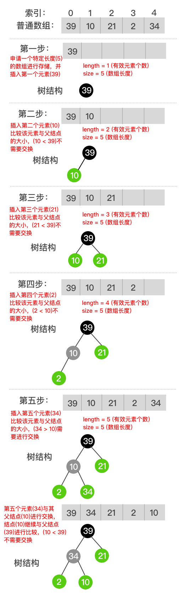
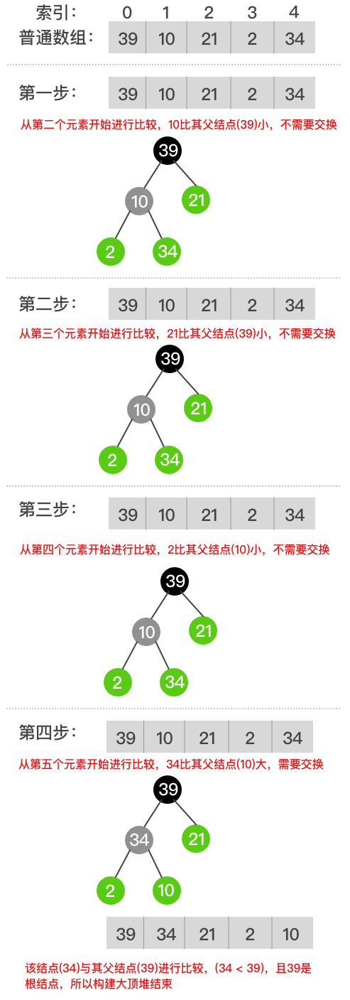

# 大顶堆

父结点的值比每一个孩子结点的值都要大的堆叫做大顶堆，利用这个性质，可以快速的找到构成大顶堆的集合中的最大元素。

### 结构定义

定义一个`int`类型的大顶堆数据结构。

```go
// 大顶堆
type maxHeap struct {
	length int   // 堆中有效数据
	size   int   // 堆申请的数组大小
	data   []int // 数据
}
```

定义`length`属性的目的便于删除元素。当删除元素时，只需要改变`length`的大小，并不需要特意清空元素中的值，在有特殊需要的情况下，可以对上一步删除的元素进行找回。

定义`size`的目的是限制堆中允许存放的元素个数。因为堆是由数组实现的完全二叉树，所以数组的大小不能随意改变，如果频繁改变其大小，内存将会被频繁分配，而且数组的内存地址必须是连续的，为了能够开辟一片连续的内存空间，可能导致垃圾回收频繁，从而引发一系列不确定的问题。

### 构造思路

通常构造堆有两种情况，一种是逐个插入元素，一种是根据已知数组直接构建。

* 插入法



插入法基本步骤如下：
1. 在数组末端添加元素；
2. 根据下标关系，比较该元素与其父结点的大小；
3. 如果其值比父结点大，则交换其与父结点的位置；
4. 继续与新添元素的父结点值比较大小；
5. 重复第三步，直到找到根节点或者值比父结点小。

* 构建法



构建法基本步骤如下：
1. 从第二个元素开始比较；
2. 根据下标关系，比较该元素与其父结点的大小；
3. 如果其值比父结点大，则交换其与父结点的位置；
4. 继续与新添元素的父结点值比较大小；
5. 重复第三步，直到找到根节点或者值比父结点小；
6. 从下一个元素开始比较；
7. 重复第2-6步，直到数组中的所有元素遍历完毕。

根据描述可知，构建法就是数组内部实现的依次插入法。
