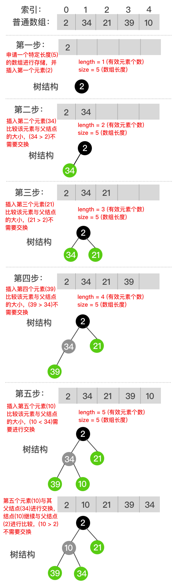
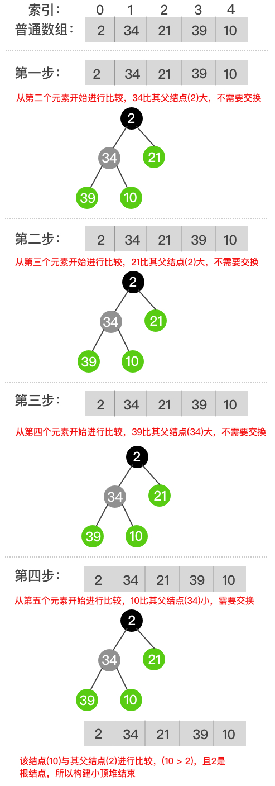

# 小顶堆

父结点的值比每一个孩子结点的值都要小的堆叫做大顶堆，利用这个性质，可以快速的找到构成大顶堆的集合中的最小元素。

### 结构定义

小顶堆与大顶堆的结构完全一致。

```go
// 小顶堆
type minHeap struct {
	length int   // 堆中有效数据
	size   int   // 堆申请的数组大小
	data   []int // 数据
}
```

### 构造思路



插入法基本步骤如下：
1. 在数组末端添加元素；
2. 根据下标关系，比较该元素与其父结点的大小；
3. 如果其值比父结点小，则交换其与父结点的位置；
4. 继续与新添元素的父结点值比较大小；
5. 重复第三步，直到找到根节点或者值比父结点大。



构建法基本步骤如下：
1. 从第二个元素开始比较；
2. 根据下标关系，比较该元素与其父结点的大小；
3. 如果其值比父结点小，则交换其与父结点的位置；
4. 继续与新添元素的父结点值比较大小；
5. 重复第三步，直到找到根节点或者值比父结点大；
6. 从下一个元素开始比较；
7. 重复第2-6步，直到数组中的所有元素遍历完毕。

根据描述可知，构建法就是数组内部实现的依次插入法。
