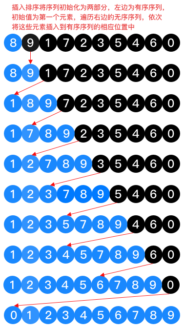

# 直接插入排序

直接插入排序的基本思想是依次将元素将插入到已经排序好的有序序列中，从而得到一个新的有序序列。

直接插入最典型的生活中例子是打扑克牌，从牌堆中摸取牌后，插入到适当的位置，使得手中的扑克牌有序。

### 流程分析

如上图所示，是对无序序列[8,9,1,7,2,3,5,4,6,0]采用的直接插入排序。

1. 将[8]视为有序序列，剩余的[9,1,7,2,3,5,4,6,0]视为无序序列；

2. 遍历右边的无序序列，将其中的元素逐个插入到左边的有序序列中，9插入到8的后面，即左边的有序序列变为[8,9]，无序序列还剩余[1,7,2,3,5,4,6,0];

3. 重复上述步骤，直到插入无序序列中的最后一个元素。

### 算法分析

1. 最好情况，当初始序列有序时，比较次数最少
   $$C_{min} = n - 1$$
   ，时间复杂度O(n);

2. 最坏情况，当初始序列逆序时，移动次数最多
   $$M_{max} = (n-1) + (n-2) + . . . + 1 = \frac{n(n-1)}{2}$$
   ，时间复杂度为
   $$O(n^2)$$
   。

3. 一般情况下，初始序列既不是有序的，也不是逆序的，经过均摊分析，其平均时间复杂度为
$$O(n^2)$$
。

4. 在进行插入时，若两个元素相等，插入元素放在相等元素的后面，从而确保直接插入排序是稳定的。

5. 直接插入排序中只使用了有限个辅助变量，与问题规模n无关，所以空间复杂度为O(1)。
