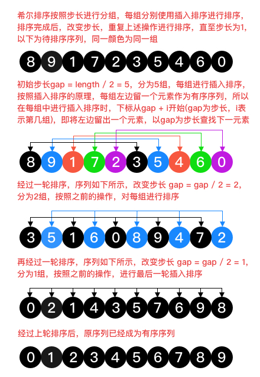

# 希尔排序

希尔排序的本质也是一种插入排序，按照步长(增量)将序列进行分组，对每组采用直接插入排序，再缩小步长(增量)将序列重新分组，依然对每组采用直接插入排序，直到步长(增量)减小为1时结束。

增量的选取不同，希尔排序的效率也会不同，通常采用的是折半插入法，即增量开始为序列长度的一半，然后逐渐减半，直到为1。

### 流程分析

如上图所示，是对无序序列[8,9,1,7,2,3,5,4,6,0]采用的希尔排序。

1. 初始增量取序列长度的一半，gap = 10 / 2 = 5，将序列分为5组，[8,3]、[9,5]、[1,4]、[7,6]、[2,0]；

2. 分别对每组进行直接插入排序，3与8互换位置，5与9互换位置，6与7互换位置，0与2互换位置，得到[3,5,1,6,0,8,9,4,7,2]；

3. 增量值减半，gap = 5 / 2 = 2，将序列分为两组，[3,1,0,9,7]、[5,6,8,4,2]；

4. 分别对每组进行直接插入排序，[0,1,3,7,9]和[2,4,5,6,8]，得到[0,2,1,4,3,5,7,6,9]；

5. 增量再次减半，gap = 2 / 2 = 1，序列已经只有一组，对其进行直接插入排序，得到[0,1,2,3,4,5,6,7,8,9]。

### 算法分析

1. 最好情况，当初始序列有序时，根据增量序列的选取不同，其时间复杂度也不相同

  * 当增量序列为[1]时，此时希尔排序的本质就是直接插入排序，所以其时间复杂度为O(n)。

  * 当增量序列为[n/2, n/4, ..., 1]时，此时就是折半插入排序，增量序列的个数为logn，每个增量下都是有序的直接插入排序，所以只有比较，没有交换。

    设某个增量将序列分为m组，每组中的元素个数为
    $$k_i$$
    ，这正是每组进行直接插入排序比较的次数，而
    $$\sum_{i=1}^m k_i = n$$
    ，因此对于该增量，比较次数为n。总共有logn个增量，所以整个折半插入排序的总次数为nlogn，即其时间复杂度为O(nlogn)。

  * 当增量序列为Hibbard增量
  $$[2^k - 1, . . ., 7, 3, 1]$$
  时，增量个数为k，其时间复杂度为O(n*k)。

2. 最坏情况，当初始序列逆序时，根据增量序列的选取不同，其时间复杂度也不相同

  * 当增量序列为[1]时，此时希尔排序的本质就是直接插入排序，所以其时间复杂度为
  $$O(n^2)$$
  。

  * 当增量序列为[n/2, n/4, ..., 1]时，此时就是折半插入排序。

    假设序列的总个数为
    $$n = 2^i$$
    ，设某个增量将序列分为m组，每组中的元素个数为
    $$\frac{n}{m}$$
    ，而且每组中都是一个逆序序列，则每组的时间复杂度为
    $$O((\frac{n}{m})^2)$$
    ，共有m组，所以**该增量下的一趟排序时间复杂度为**
    $$
      m*O((\frac{n}{m})^2)
      = O(m*(\frac{n}{m})^2)
      = O(\frac{n^2}{m})
    $$
    。
    总共有logn趟排序，从第一趟到最后一趟，因为总个数是2的幂，所以上式中的m值分别为
    $$\frac{n}{2}, \frac{n}{4}, . . ., 1$$
    ，总的时间复杂度为
    $$\sum_{i=1}^{logn} \frac{1}{m_i} * O(n^2)$$
    ，在该式中，左边的级数其实可以看做是一个首项为1，公比为
    $$\frac{1}{2}$$
    的等比数列求和，由等比数列的求和公式可知，
    $$S_n = \frac{1-q^n}{1-q}$$
    ，当0 < q < 1时，
    $$S_n \leqslant \frac{1}{1-q}$$
    ，取
    $$q=\frac{1}{2}$$
    ，
    $$S_n \leqslant 2$$
    ，总的时间复杂度
    $$\sum_{i=1}^{logn} \frac{1}{m_i} * O(n^2) \leqslant 2*O(n^2)$$
    ，综上所述，最坏时间复杂度为
    $$O(n^2)$$
    。

  * 当增量序列为Hibbard增量时，证明过程比较复杂，所以进行分段证明。
    其增量序列为：
    $$[2^k - 1, . . ., 7, 3, 1]$$
    。

    在折半插入排序的证明中，已经得到结论，在某个增量下，一趟排序的时间复杂度为
    $$O(\frac{n^2}{m})$$
    ，其中m是将序列分得的组数。

    先举个简单的例子，15和7都是Hibbard序列中的值，假设已经使用增量15进行了一趟排序，则待排序的序列中，相隔15个位置的元素是有序的，再经过增量7进行排序，则待排序的序列中，相隔7个位置的元素是有序的，那么所有元素的位置index能被7或15整除(index=a\*7+b\*15，a,b是整数)的元素是有序的。

    $$m_{i+2}=2^{i+2}-1=2*2^{i+1}-1=2*(2^{i+1}-1)+1=2*m_{i+1}+1$$
    ，显然
    $$m_{i+2} - 2*m_{i+1} = 1$$
    而且
    $$m_{i+2}$$
    与
    $$m_{i+1}$$
    互质。

    $$
      (m_{i+2}-1)(m_{i+1}-1)
      = [m_{i+2}-(m_{i+2}-2*m_{i+1})]*[m_{i+1}-(m_{i+2}-2*m_{i+1})]
      = 2*m_{i+1}(3*m_{i+1}-m_{i+2})
      = 8m_i^2 + 4m_i
    $$

    由上式可知，
    $$(m_{i+2}-1)(m_{i+1}-1)$$
    可由
    $$m_{i+2}$$
    和
    $$m_{i+1}$$
    线性表示，也就是说当取第i个增量的时候，所有下标为
    $$8m_i^2+4m_i$$
    的元素已经有序，所以只需要比较不需要交换，总共有
    $$m_i$$
    组，则每组最多(并不是每组个数都相同)比较
    $$8m_i+4$$
    次，第m趟排序的时间复杂度是
    $$O(n*m_i)$$
    。

    为了证明时间复杂度的上界，将增量序列分为两部分，以
    $$m_i < \sqrt{n}$$
    的一半(k/2，假设k为偶数)为分界线，小于的部分使用公式
    $$O(n*m_i)$$
    进行计算，结果为
    $$O(n*\sum_{i=1}^{\frac{k}{2}}m_i)$$
    ，大于部分使用公式
    $$O(\frac{n^2}{m_i})$$
    进行计算，结果为
    $$O(\frac{n^2}{\sum_{i=\frac{k}{2}+1}^{k}m_i})$$
    ，由于取
    $$\sqrt{n}$$
    作为分界值，所以两个求和级数
    $$\sum_{i=1}^{\frac{k}{2}}m_i$$
    和
    $$\sum_{i=\frac{k}{2}+1}^{k}m_i$$
    都是与
    $$O(\sqrt{n})$$
    同阶的。最终的时间复杂度就变为
    $$O(n*\sqrt{n}) + O(\frac{n^2}{\sqrt{n}})=O(n^{\frac{3}{2}})$$
    。

3. 一般情况下，初始序列既不是有序的，也不是逆序的，经过均摊分析，其平均时间复杂度与选择的增量序列有关。

  * 当增量序列为[1]时，此时希尔排序的本质就是直接插入排序，所以其平均时间复杂度为
  $$O(n^2)$$
  。

  * 当增量序列为[n/2, n/4, ..., 1]时，此时就是折半插入排序，其平均时间复杂度为
  $$O(n^2)$$
  。

  * 当增量序列为Hibbard增量时，其平均时间复杂度是一个猜想值，并未得到证明，值为
  $$O(n^\frac{5}{4})$$
  。

4. 在进行希尔排序时，若两个元素相等，由于相同的元素可能不会分在同一组，而插入时只能确保同一组的排序稳定，所以从整体上来说无法希尔排序是不稳定的。

5. 希尔排序中只使用了有限个辅助变量，与问题规模n无关，所以空间复杂度为O(1)。 

### 增量序列

对于希尔排序，常用的增量序列有以下三种：

* 折半序列

  [n/2, n/4, ..., 1]

  最好时间复杂度：O(nlogn)

  最坏时间复杂度：
  $$O(n^2)$$

  平均时间复杂度：
  $$O(n^2)$$

* Hibbard序列

  $$[2^k - 1, . . ., 7, 3, 1]$$

  最好时间复杂度：O(n*k)

  最坏时间复杂度(论证见算法分析的最坏情况)：
  $$O(n^{\frac{3}{2}})$$

  平均时间复杂度(猜想未证明)：
  $$O(n^\frac{5}{4})$$

* Sedgewick序列

  $$[9 * 4^i - 9 * 2^i + 1, . . ., 19, 5, 1]$$

  最好时间复杂度：O(n*i)

  最坏时间复杂度：
  $$O(n^{\frac{4}{3}})$$

  平均时间复杂度(猜想未证明)：
  $$O(n^{\frac{7}{6}})$$
